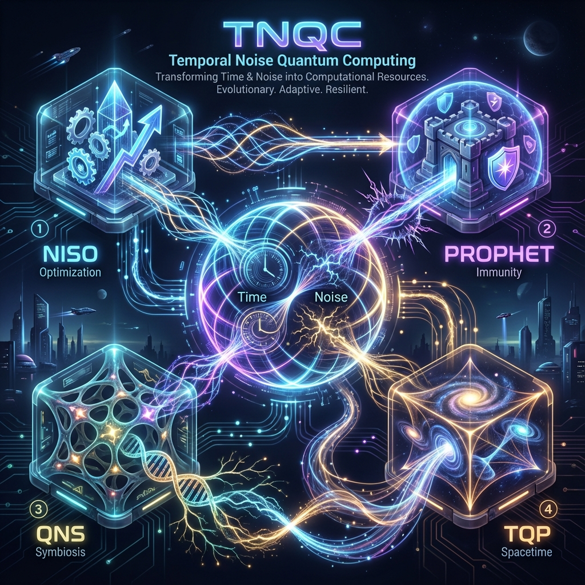

# TNQC: Temporal Noise Quantum Computing

[](LICENSE)



## 🌌 Overview

**TNQC (Temporal Noise Quantum Computing)** is a unified computing paradigm that redefines **Time** and **Noise**—traditionally viewed as adversaries in quantum information processing—as strategic computational resources.

Instead of fighting thermodynamics, TNQC adopts an adaptive approach:
> **"Time offers opportunity; Noise offers possibility."**

For a detailed technical overview, please refer to the **[TNQC Integrated Specification](docs/TNQC_Integrated_Specification.md)**.

---

## 🏗️ The 4 Pillars of TNQC

TNQC is realized through four interconnected technologies, each addressing a specific layer of the quantum stack.

### 1. [NISO (Optimization Engine)](https://github.com/sadpig70/NISO)

**NISQ Integrated System Optimizer**

* **Role**: Tactical Layer (Optimization)
* **Key Tech**: **TQQC** (Temporal Quantum Quality Control) - Tuning temporal parameters to mitigate errors.
* **Result**: +12.13% avg fidelity improvement, ~51% computation saved (7-qubit simulation)

### 2. [PROPHET (Immunity Platform)](https://github.com/sadpig70/PROPHET)

**Predictive Risk Operations**

* **Role**: Strategic Layer (Immunity)
* **Key Tech**: **NQC** (Noise Quantum Computing) - Predicting collapse via noise injection & RL-based self-healing.
* **Status**: Multi-backend support (IBM, AWS, IonQ)

### 3. [QNS (Symbiotic Framework)](https://github.com/sadpig70/QNS)

**Quantum Noise Symbiote**

* **Role**: Adaptive Layer (Symbiosis)
* **Key Tech**: **DriftScanner** & **LiveRewirer** - Real-time adaptation to hardware noise drift.
* **Status**: JIT circuit rewiring implemented

### 4. [TQP (Spacetime Architecture)](https://github.com/sadpig70/TQP)

**Temporal Quantum Processor**

* **Role**: Structural Layer (Virtualization)
* **Key Tech**: **Temporal OS** - Expanding physical qubits via time-bin multiplexing.
* **Result**: LiH molecular simulation with **1.77 mHa** error (chemical accuracy) on `ibm_fez`

---

## 📊 Preliminary Results

| Component | Benchmark | Metric | Result |
|-----------|-----------|--------|--------|
| **NISO** | 7-qubit H-chain | Fidelity | +12.13% (p=0.02) |
| **TQP** | LiH (4-qubit) | Energy Error | 1.77 mHa ✅ |
| **TQP** | H₂ (4-qubit) | Energy Error | 3.97 mHa |

> **Chemical Accuracy Threshold**: 1.6 mHa (1 kcal/mol)

---

## 🔧 TNQC SDK

```
TNQC SDK
├── tnqc.optimize    # NISO/QNS-based noise-adaptive optimization
├── tnqc.simulate    # TQP-based spatiotemporal simulation
├── tnqc.hardware    # IBM Quantum and real hardware integration
└── tnqc.analyze     # PROPHET-based risk/stability analysis
```

---

## 📜 License

This project is licensed under the MIT License - see the [LICENSE](LICENSE) file for details.

**Author**: Jung Wook Yang (<sadpig70@gmail.com>)
